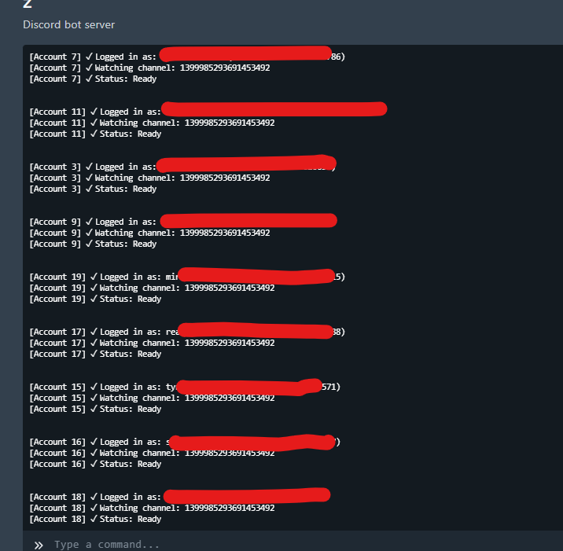

<h1 align="center">Discord Giveaway Joiner</h1>

  A Discord selfbot giveaway joiner built around <code>main.py</code>.

  
  
  

## Overview

This project is a Discord selfbot giveaway joiner. The entry point in [main.py](main.py) reads your local config, connects through the bundled `discord.py-self` client, watches a selected channel, detects giveaway messages with an `Entry` button, and clicks it automatically.

It currently supports Invite Tracker style giveaway messages only.

## Features

- Automatic giveaway entry handling
- Multi-account support through config tokens
- Channel targeting from local JSON config
- Random delay before clicking the entry button
- Basic error handling for missing buttons, permissions, and message failures
- Windows-friendly install and run scripts

## Tech Stack

- Python (asyncio runtime)
- discord.py-self (bundled in repository)
- JSON-based configuration
- Batch scripts for local Windows workflow

## Installation

1. Clone the repository

~~~powershell
git clone https://github.com/Zectxr/disboard-autobump.git
cd disboard-autobump
~~~

2. Install dependencies

~~~powershell
install.bat
~~~

3. Update configuration in [config/config.json](config/config.json)

~~~json
{
  "tokens": ["PUT YOUR TOKEN HERE"],
	"prefix": "!",
	"channel_id": "YOUR_CHANNEL_ID",
  "min_delay": 10,
  "max_delay": 300
}
~~~

## Usage

Start the app:

~~~powershell
run.bat
~~~

Alternative direct run:

~~~powershell
python main.py
~~~

Expected flow:

1. Client logs in using one or more configured tokens
2. Script watches the selected channel for giveaway posts
3. When an `Entry` button is found, the bot waits a random delay and clicks it
4. Stats are printed for detected, joined, and failed attempts

## Proof

  

## Notes

- This repository is intended for selfbot-style automation only where you have explicit authorization.
- Invite Tracker is the only giveaway format this script is described to support.
- Make sure the configured channel contains the giveaway messages you want to join.

## Disclaimer

Self-bot usage may violate Discord Terms of Service and may lead to account restrictions. Use this project responsibly, only in environments where you have explicit authorization.
